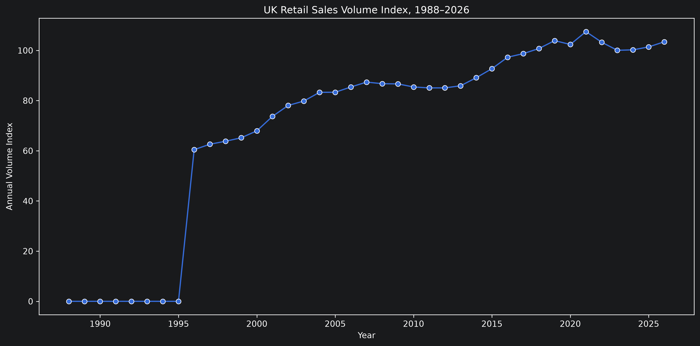
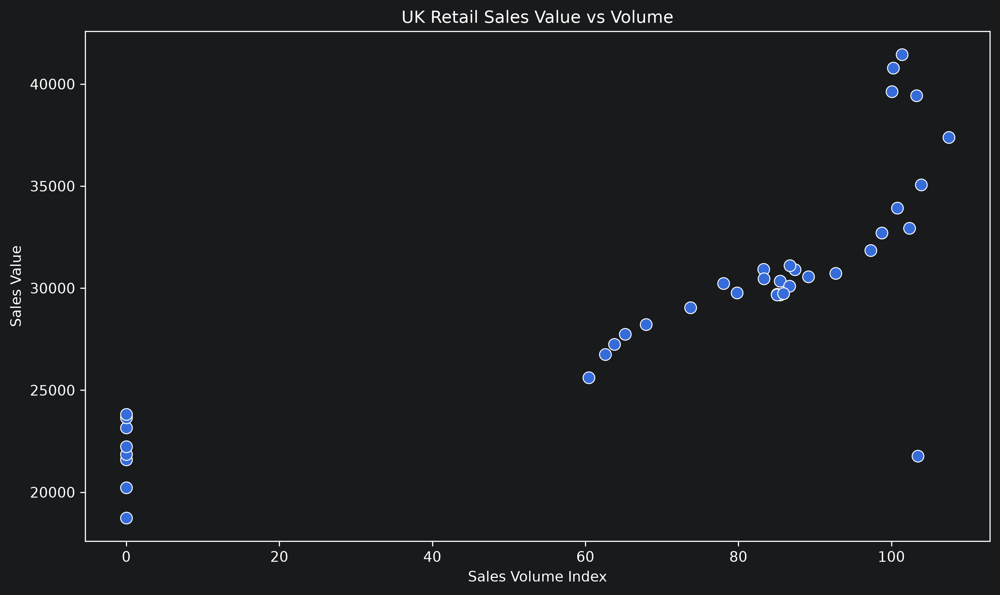
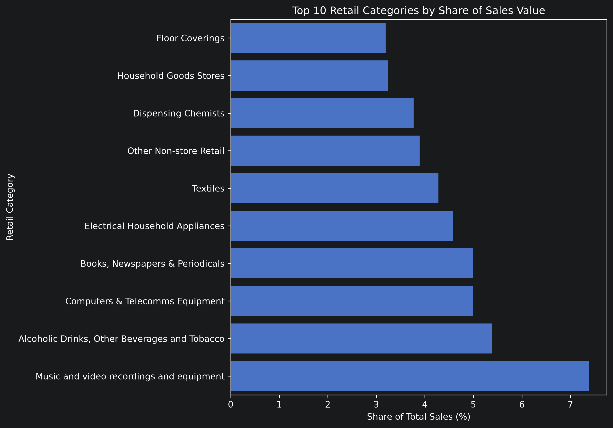
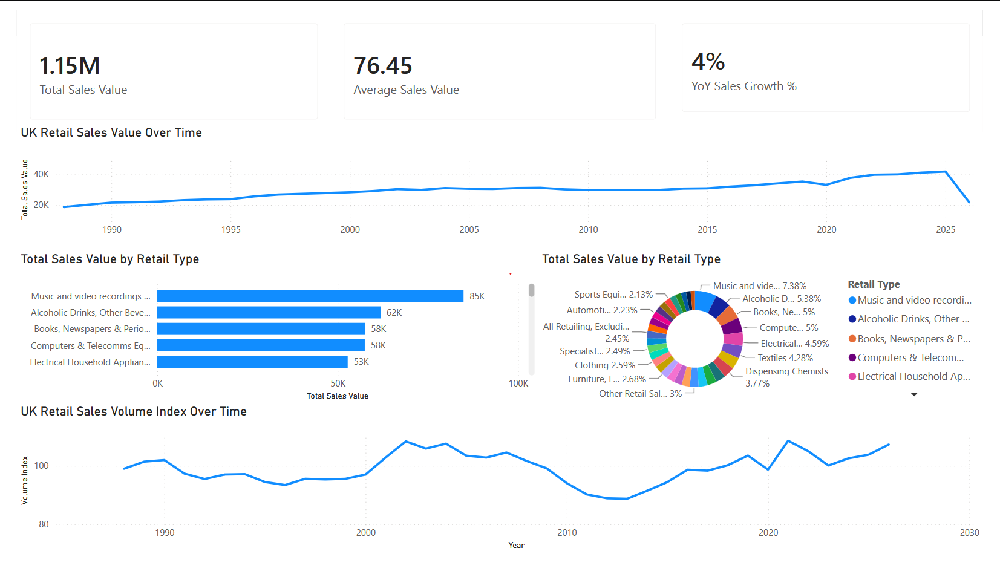

<div align="center">

  <h1>UK Retail Sales Analysis (1988–2026)</h1>
  <p><strong>ONS retail data · SQL · PostgreSQL · Python · Power BI</strong></p>
  <p><em>Volume trends · Value growth · Category performance · Inflation divergence</em></p>

  <br>

  <p>
    <a href="./database/queries/">🗄️ SQL Queries</a>
    &nbsp;·&nbsp;
    <a href="./notebooks/">📓 Notebooks</a>
    &nbsp;·&nbsp;
    <a href="./powerbi/">📊 Power BI Dashboard</a>
    &nbsp;·&nbsp;
    <a href="https://github.com/FakeyeTami/uk-retail-analysis/issues/new">🐛 Report Issue</a>
  </p>

  <br>

  
  
  
  

</div>

---

## 📸 Preview

<div align="center">
  
  <br><br>
  
  <br><br>
  
  <br><br>
  
</div>

---

## 🎯 The Business Questions

The UK Office for National Statistics publishes retail sales data across volume and value dimensions, broken down by retail category from 1988 to the present. The raw data is split across multiple worksheets and index series. This project loads, cleans, and integrates three source tables into a PostgreSQL star schema, then answers six business questions through SQL queries, Python analysis, and a Power BI dashboard.

---

## Business Questions Answered

### Task 1 — SQL analysis

| # | Question | SQL technique |
|---|---|---|
| 1 | How has UK retail sales volume changed from 1988 to 2026? | Time series aggregation, annual GROUP BY |
| 2 | How has the value of UK retail sales changed over the same period? | Time series aggregation, joined to dim_date |
| 3 | How did retail performance in 2025/2026 compare with 2023? | Filtered comparison, percentage change calculation |
| 4 | Which retail categories contribute the most sales value? | Window functions, percentage of total |
| 5 | Which categories have grown the most? | Growth rate calculation, RANK() / DENSE_RANK() |
| 6 | How does sales value growth compare with volume growth — and what does the gap reveal? | Dual-series join, divergence calculation |

### Task 2 — Visualisation

Six charts and a two-page Power BI dashboard communicating findings to a non-technical audience:

1. **UK retail volume trend (1988–2026)** — line chart with annotated events (financial crisis, COVID, cost-of-living)
2. **UK retail value trend (1988–2026)** — overlaid on volume to show nominal growth
3. **2025/2026 vs 2023 comparison** — grouped bar chart by category
4. **Category contribution to total sales value** — horizontal bar chart sorted descending
5. **Category growth ranking** — bar chart sorted by compound growth rate
6. **Value vs volume divergence** — dual-axis line chart showing widening inflation gap

---

## 🧰 Built With

<div align="center">


&nbsp;
&nbsp;
&nbsp;
&nbsp;
&nbsp;

</div>

---

## 🏗️ Repository Structure

```text
uk-retail-analysis/
│
├── data/
│   ├── raw/                              // original ONS CSVs — never modified
│   │   ├── uk_retail_volume_monthly.csv  // Table 1 M — chained volume index
│   │   ├── uk_retail_value_monthly.csv   // Table 2 M — value at current prices
│   │   └── uk_retail_categories.csv      // Table 5 — category metadata and weights
│   │
│   └── processed/                        // cleaned outputs from 01_data_cleaning.ipynb
│       ├── retail_volume_clean.csv
│       ├── retail_value_clean.csv
│       └── retail_categories_clean.csv
│
├── database/
│   ├── schema.sql                        // CREATE TABLE statements — star schema
│   ├── load.sql                          // COPY commands to load processed CSVs
│   └── queries/
│       ├── 01_volume_trend_1988_2026.sql
│       ├── 02_value_trend_over_time.sql
│       ├── 03_2025_2026_vs_2023.sql
│       ├── 04_category_value_contribution.sql
│       ├── 05_category_growth_ranking.sql
│       └── 06_value_vs_volume_divergence.sql
│
├── notebooks/
│   ├── 01_data_cleaning.ipynb            // raw → processed; every decision documented
│   ├── 02_eda.ipynb                      // exploratory charts and anomaly detection
│   └── 03_analysis.ipynb                 // answers all six business questions with charts
│
├── visuals/
│   └── exports/
│       ├── volume_trend.png
│       ├── value_trend.png
│       ├── 2025_vs_2023_comparison.png
│       ├── category_contribution.png
│       ├── category_growth.png
│       └── value_vs_volume.png
│
├── powerbi/
│   ├── uk_retail_dashboard.pbix
│   └── screenshots/
│       ├── overview_page.png
│       └── category_page.png
│
├── requirements.txt
└── README.md
````

---

## Data Model

Three ONS source files integrated into a PostgreSQL star schema:

```text
ONS source files
  uk_retail_volume_monthly.csv  ──→  retail_volume_monthly (fact)
  uk_retail_value_monthly.csv   ──→  retail_value_monthly  (fact)
  uk_retail_categories.csv      ──→  retail_category       (dimension)

Star schema
  dim_date            ──┬──→  retail_volume_monthly
  (date_id, year,       │     (date_id, category_id, volume_index)
   quarter, month)      │
                        └──→  retail_value_monthly
                              (date_id, category_id, sales_value)

  retail_category ──────────→  retail_volume_monthly
  (category_id,                retail_value_monthly
   category_name,
   dataset_code,
   percentage_weight,
   sales_2023)
```

---

## Data Cleaning Steps

All cleaning decisions are documented in `01_data_cleaning.ipynb` with a markdown cell explaining the decision and its impact on row counts.

| Step                           | Source              | Action                                       | Reason                                                |
| ------------------------------ | ------------------- | -------------------------------------------- | ----------------------------------------------------- |
| Metadata rows skipped          | All files           | `skiprows` on CSV read                       | ONS files contain publication headers above the data  |
| Wide → long format (melt)      | Volume, value files | Unpivot category columns into rows           | Source is wide format; schema requires long format    |
| ONS `..` markers handled       | Volume, value files | Replaced with `NaN`, documented count        | ONS uses `..` for suppressed or unavailable data      |
| Date parsed to standard format | Volume, value files | Standardised to `YYYY-MM`                    | Enables reliable date arithmetic in SQL and Power BI  |
| Category codes validated       | Categories file     | Cross-checked against column headers         | Mismatches would cause foreign key violations on load |
| Aggregated rows identified     | Categories file     | Flagged for exclusion from granular analysis | Prevents double-counting when summing by category     |

---

## Local Setup

### Prerequisites

* Python 3.10+
* PostgreSQL 15+
* Power BI Desktop (Windows)
* DataSpell or Jupyter

### 1. Clone

```bash
git clone https://github.com/FakeyeTami/uk-retail-analysis.git
cd uk-retail-analysis
```

### 2. Install Python dependencies

```bash
pip install -r requirements.txt
```

### 3. Add raw data files

The three ONS CSV files are not committed to this repository. Place them in `data/raw/` before running the notebooks.

Source: [ONS Retail Sales Index](https://www.ons.gov.uk/businessindustryandtrade/retailindustry/datasets/retailsalesindexreferencetables)

Expected files:

```text
data/raw/uk_retail_volume_monthly.csv
data/raw/uk_retail_value_monthly.csv
data/raw/uk_retail_categories.csv
```

### 4. Run in order

```bash
# 1. Clean the raw data
jupyter notebook notebooks/01_data_cleaning.ipynb

# 2. Create the PostgreSQL schema
psql -d your_database -f database/schema.database

# 3. Load processed data into PostgreSQL
psql -d your_database -f database/load.database

# 4. Explore the data
jupyter notebook notebooks/02_eda.ipynb

# 5. Run the full analysis
jupyter notebook notebooks/03_analysis.ipynb
```

### 5. Open the Power BI dashboard

Open `powerbi/uk_retail_dashboard.pbix` in Power BI Desktop. Update the PostgreSQL connection string to your local instance when prompted.

---

## Pipeline

```
Load (3 ONS CSV files — raw, untouched)

Clean (01_data_cleaning.ipynb)
  · Skip ONS metadata header rows
  · Melt wide format → long format (one row per category per month)
  · Handle ONS ".." suppression markers
  · Standardise date format
  · Validate category codes against both fact files
  · Save to data/processed/

Load to PostgreSQL (schema.sql → load.sql)
  · dim_date and retail_category loaded first (dimensions)
  · retail_volume_monthly and retail_value_monthly loaded second (facts)
  · Row counts verified after each table load

Explore (02_eda.ipynb)
  · Full time series plots — verify COVID dip, crisis events visible
  · Value vs volume plotted together — divergence visible pre-analysis
  · Anomaly check — flag any unexpected breaks in the series

Analyse (03_analysis.ipynb + database/queries/)
  · Six SQL queries — one per business question
  · Python pulls query results into Pandas for charting
  · Six charts exported to visuals/exports/

Visualise (Power BI)
  · Star schema imported from PostgreSQL
  · DAX measures: average price, YoY change, category share, growth index
  · Two report pages: executive summary and category drill-down
  · Exported to powerbi/screenshots/
```

---

## Key Concepts

* Star schema design with fact and dimension tables in PostgreSQL
* ONS data cleaning — handling metadata rows, wide-to-long transformation, suppression markers
* Window functions for percentage-of-total and growth ranking in SQL
* Dual-series analysis: separating volume and value to reveal inflation effects
* DAX measures in Power BI: `SAMEPERIODLASTYEAR`, `CALCULATE`, `ALLSELECTED` for time intelligence
* Jupyter notebook narrative — code and commentary structured for a non-technical reader

---

## Data Source

Office for National Statistics — Retail Sales Index (RSI)

[ons.gov.uk/businessindustryandtrade/retailindustry](https://www.ons.gov.uk/businessindustryandtrade/retailindustry/datasets/retailsalesindexreferencetables)

Data is © Crown copyright and database right. Released under the [Open Government Licence v3.0](https://www.nationalarchives.gov.uk/doc/open-government-licence/version/3/).

---

## 🤝 Let's Connect

<div align="center">

[](https://linkedin.com/in/fakeyetami)
 [](https://github.com/FakeyeTami)
 [](https://tamicodes.dev)
 [](mailto:fakeyetami@gmail.com)

</div>

---

<div align="center">
  <sub>Built with attention to detail · © 2026 Tamilore Fakeye</sub>
</div>
